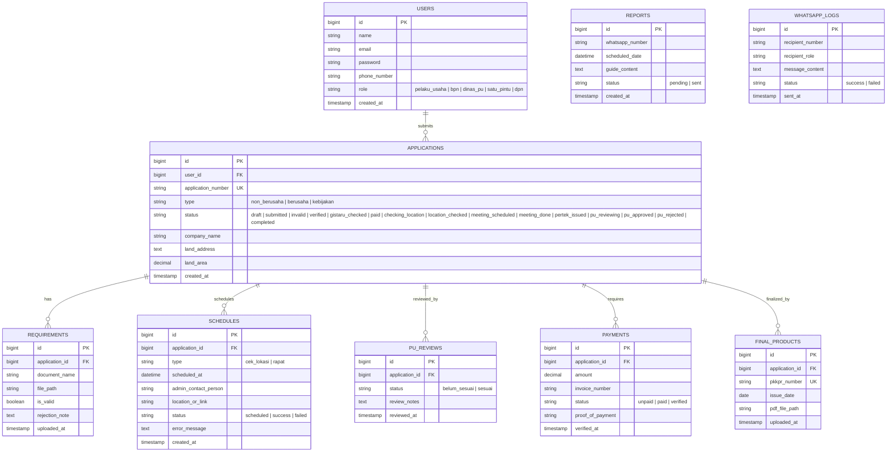
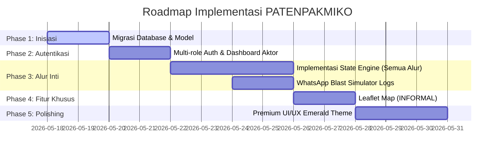

# Blueprint & Rencana Implementasi Sistem PATENPAKMIKO

Dokumen ini adalah cetak biru teknis (technical blueprint) yang merinci arsitektur database, pembagian hak akses aktor, mesin status alur kerja (workflow state machine), visual design system, serta rencana pengerjaan sistem **PATENPAKMIKO** berbasis Laravel 13 dan PHP 8.3.

---

## 1. Analisis Aktor & Hak Akses (Multi-Role Auth)
Sistem ini melibatkan beberapa aktor dengan hak akses spesifik pada dashboard masing-masing:

| Aktor / Role | Deskripsi | Hak Akses Utama |
| :--- | :--- | :--- |
| **Pelaku Usaha (PU / Pemohon)** | Masyarakat / Pelaku Bisnis | Registrasi, Login, Unduh Formulir/Contoh Persyaratan, Submit Persyaratan, Menerima Jadwal, Melihat Status Pertek, Memberikan Penilaian. |
| **BPN (Badan Pertanahan Nasional)** | Validator & Penerbit Utama | Validasi Berkas (Non Berusaha/Berusaha/Kebijakan), Cek Gistaru, Validasi Pembayaran, Input Jadwal Cek Lokasi, Input Jadwal Rapat, Menerbitkan Pertek Pertanahan. |
| **Dinas PU (Pekerjaan Umum / Tata Ruang)** | Penilai Teknis (Modul Berusaha) | Menerima Notifikasi Berkas Masuk (Berusaha), Melakukan Penilaian Teknis Tata Ruang, Menyetujui/Menolak berdasarkan Penilaian Teknis. |
| **1 Pintu (PTSP / DPMPTSP)** | Gatekeeper Produk Akhir | Menerima Notif Approval Dinas PU, Input nomor PKKPR & tanggal terbit, Upload PDF produk akhir, Mengirimkan produk akhir ke semua pihak. |
| **DPN (Dashboard Penerima Notifikasi / Super Admin)** | Super Admin / Administrator Utama | Memantau seluruh pelaporan masuk dari jalur **LAPOR-PA**, memantau semua antrean berkas pemohon secara global, log WhatsApp Blast, serta konfigurasi sistem. |

---

## 2. Arsitektur Database (Database Schema)
Untuk mendukung status yang dinamis dan multi-alur, berikut adalah rancangan tabel database yang akan kita migrasikan:



---

## 3. Rancangan State Machine (Transisi Status Alur Kerja)
Sistem backend Laravel akan menggunakan pola state transition yang ketat agar integritas alur terjaga:

### A. PPKPR Non Berusaha & Kebijakan (Bypass Gistaru & Pembayaran)
```
[DRAFT] -> (Submit Persyaratan) -> [SUBMITTED]
                                      |
                     (Validasi BPN) --+-- (Jika Tidak Valid) -> [INVALID] -> (Submit Kembali)
                                      |
                     (Jika Valid) ----+-> [VERIFIED] (Kirim WA ke PU untuk ke loket BPN)
                                      |
                           (BPN input cek lokasi) -> [CHECKING_LOCATION]
                                      |
                          (Tim cek lapangan) -> [LOCATION_CHECKED]
                                      |
                          (BPN input rapat) -> [MEETING_SCHEDULED]
                                      |
                              (Rapat) -> [MEETING_DONE]
                                      |
                      (Terbit Pertek) -> [COMPLETED]
```

### B. PPKPR Berusaha (Jalur Tengah)
```
[DRAFT] -> (Submit) -> [SUBMITTED] 
                          |
             (Validasi BPN) -- (Tidak Valid) -> [INVALID] -> (Submit Kembali)
                          |
             (Jika Valid) -> [VERIFIED] (Notif WA ke PU)
                          |
           (PU kirim notif) -> [NOTIFIED_PU] (WA ke PU & BPN)
                          |
         (BPN cek Gistaru) -> [GISTARU_CHECKED]
                          |
      (BPN validasi bayar) -> [PAID] (Jika belum bayar -> Notif bayar -> Kembali ke Validasi)
                          |
    (BPN input cek lokasi) -> [CHECKING_LOCATION] -> (Cek Lapangan) -> [LOCATION_CHECKED]
                          |
       (BPN input rapat) -> [MEETING_SCHEDULED] -> (Rapat) -> [MEETING_DONE]
                          |
      (Terbit Pertek BPN) -> [PERTEK_ISSUED] (Notif PU & PU Pertek Selesai)
                          |
       (PU Dinas menilai) -> [PU_REVIEWING] -- (Belum Sesuai) -> Status "Belum Sesuai" -> Kembali menilai
                          |
             (Sesuai) -> [PU_APPROVED] (Notif WA ke 1 Pintu)
                          |
      (1 Pintu input & PDF) -> [COMPLETED] (Notif BPN, PU, Pelaku Usaha)
```

---

## 4. Visual Design System & Aesthetics
Sesuai dengan standardisasi proyek (studi migrasi brand color hijau):
* **Brand Color Utama:** Deep Forest Emerald Green (`#006644`) sebagai warna primer premium yang merepresentasikan instansi pertanahan dan tata ruang yang elegan.
* **Secondary & Accent Colors:** 
  - Rich Mint/Green (`#10b981`) untuk status "Berhasil", "Sesuai", "Sudah Bayar".
  - Warm Amber/Gold (`#f59e0b`) untuk status "Pending", "Proses Rapat", "Cek Lapangan".
  - Deep Navy Blue (`#0f172a`) untuk background dashboard modern, dark mode, atau sidebar.
* **UI Style:** Glassmorphism modern, shadow yang subtle, border melengkung (`rounded-2xl`), tipografi modern menggunakan Google Fonts (misal: **Outfit** atau **Inter**).
* **Fitur Spasial (INFORMAL):** Interface peta interaktif berbasis Leaflet.js dengan styling dark/light map tiles premium, fitur drag-and-drop marker koordinat, dan card detail wilayah glassmorphism melayang.

---

## 5. Rencana Kerja Implementasi (Milestones)



---

> [!IMPORTANT]
> **Keputusan Arsitektur Utama:**
> 1. Proyek ini dibangun di atas Laravel 13, dengan Vite sebagai asset bundler.
> 2. Kita akan membuat simulator API WhatsApp Blast agar notifikasi real-time dapat di-debug secara langsung melalui panel log notifikasi khusus di dashboard admin.
> 3. Alur Non-Berusaha dan Kebijakan **melewati penuh** sistem Gistaru & Pembayaran langsung ke loket offline BPN.

> [!TIP]
> Kita dapat menyertakan mock data 11 PDF dokumen contoh persyaratan yang valid secara dinamis agar Pelaku Usaha dapat langsung mengunduhnya dengan lancar pada saat uji coba.

---
*(Dokumen rancangan ini siap menjadi acuan penuh kerja berkelanjutan)*
